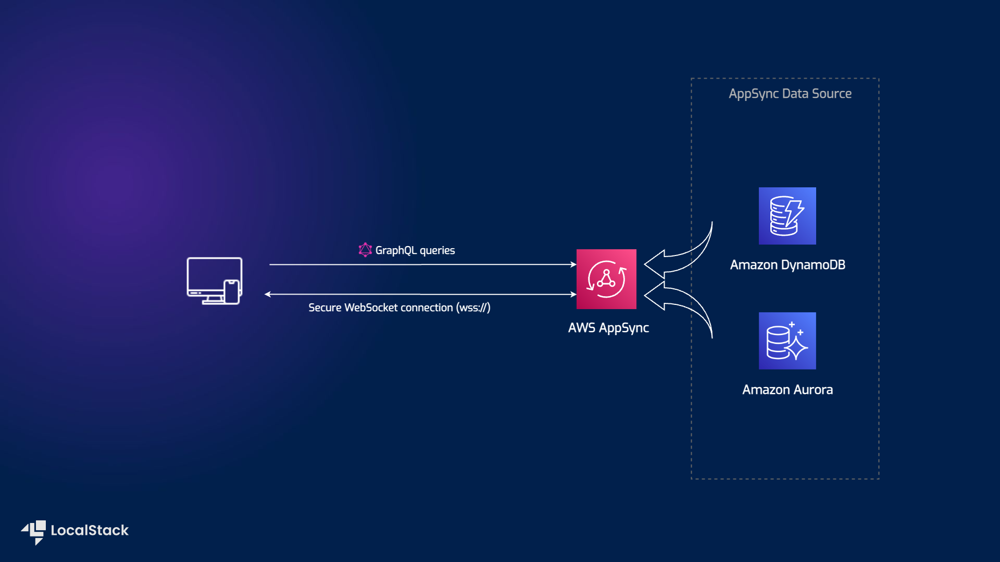

# AppSync GraphQL APIs for DynamoDB and RDS Aurora PostgreSQL

## Introduction

The AppSync GraphQL APIs for DynamoDB and RDS Aurora PostgreSQL application sample demonstrates how you can proxy data from different resources such as DynamoDB tables & RDS databases using AppSync GraphQL APIs deployed on LocalStack. The application sample leverages a secure WebSocket connection that remains constantly connected to the AppSync GraphQL API and receives real-time data from the AppSync Data Sources (DynamoDB, RDS). Users can deploy this application setup via the Serverless Framework on AWS & LocalStack with no changes. To test this application sample, we will demonstrate how you use LocalStack to deploy the infrastructure on your developer machine and your CI environment and invoke the AppSync API for DynamoDB and RDS integration.

## Architecture diagram

The following diagram shows the architecture that this sample application builds and deploys:



We are using the following AWS services and third-party integrations to build our infrastructure:

- [AppSync](https://docs.localstack.cloud/user-guide/aws/appsync/) to integrate with the Data Sources (DynamoDB, RDS) and to provide a GraphQL API which can be connected to a WebSocket connection.
- [DynamoDB](https://docs.localstack.cloud/user-guide/aws/dynamodb/) & [RDS](https://docs.localstack.cloud/user-guide/aws/rds/) to store the data for the GraphQL API and initiate a CRUDL (Create-Read-Update-Delete-List) logic in a GraphQL API.
- [Serverless Framework](https://www.serverless.com/) as our Infrastructure as Code framework to deploy the infrastructure on AWS & LocalStack with no changes, along with the [`serverless-localstack`](https://docs.localstack.cloud/user-guide/integrations/serverless-framework/) plugin.

## Prerequisites

- LocalStack Pro with the [`localstack` CLI](https://docs.localstack.cloud/getting-started/installation/#localstack-cli).
- [AWS CLI](https://docs.localstack.cloud/user-guide/integrations/aws-cli/) with the [`awslocal` wrapper](https://docs.localstack.cloud/user-guide/integrations/aws-cli/#localstack-aws-cli-awslocal).
- [Python](https://www.python.org/downloads/)
- [`cURL`](https://curl.se/)
- [`wscat`](https://github.com/websockets/wscat)

Start LocalStack Pro with the `LOCALSTACK_API_KEY` pre-configured:

```sh
export LOCALSTACK_API_KEY=<your-api-key>
localstack start
```

> If you prefer running LocalStack in detached mode, you can add the `-d` flag to the `localstack start` command, and use Docker Desktop to view the logs.

## Instructions

You can build and deploy the sample application on LocalStack by running our `Makefile` commands. Run `make install` to install the dependencies and `make run` to create the infrastructure on LocalStack. Run `make stop` to delete the infrastructure by stopping LocalStack.

Alternatively, here are instructions to deploy it manually step-by-step.

### Deploy the infrastructure

To deploy the infrastructure, we are using the Serverless Framework with the `serverless-localstack` plugin. The `serverless.yml` file contains the configuration for the infrastructure. The `serverless-localstack` plugin is configured to enable any requests to AWS to be redirected to a running LocalStack instance.

Before deploying the infrastructure, we need to install the dependencies. Run the following commands to install the dependencies:

```sh
yarn
```

To deploy the infrastructure, run the following command:

```sh
SLS_DEBUG=1 yarn deploy
```

After a few seconds, the infrastructure should be deployed successfully. Fetch the API ID and API Key by running the following commands:

```sh
export APPSYNC_URL=http://localhost:4566/graphql
api_id=$(awslocal appsync list-graphql-apis | jq -r '(.graphqlApis[] | select(.name=="test-api")).apiId')
api_key=$(awslocal appsync create-api-key --api-id $api_id | jq -r .apiKey.id)
echo $api_key
echo $api_id
```

### Setup a WebSocket connection

To setup a WebSocket connection, we need to create a Python virtual environment and install the dependencies. Run the following commands to create a Python virtual environment and install the dependencies:

```sh
virtualenv .venv
source .venv/bin/activate
pip install -r requirements.txt
```

Next, we need to create a WebSocket connection to the AppSync GraphQL API. Run the following command to create a WebSocket connection:

```sh
python websocket_client.py $api_id
```

The above script will make use of the `wscat` utility for testing the AppSync GraphQL API. The script will create a WebSocket connection using the SDK for Python (Boto3) and start a subscription client. To disconnect from your API, enter **CTRL-C**.

### Test the GraphQL API

To test the GraphQL API, we will use `cURL` to invoke the integrations with DynamoDB and RDS. Let us send a mutation request to the AppSync API to add a new post to the DynamoDB data source. The mutation specifies the `addPostDDB` field and provides the `id` parameter with a value of `id123`. The response from the API will include the `id` of the newly created post.

```sh
curl -H "Content-Type: application/json" -H "x-api-key: $api_key" -d '{"query":"mutation {addPostDDB(id: \"id123\"){id}}"}' $APPSYNC_URL/$api_id
```

Let us now send a query request to the AppSync API to retrieve all posts from the DynamoDB data source:

```sh
curl -H "Content-Type: application/json" -H "x-api-key: $api_key" -d '{"query":"query {getPostsDDB{id}}"}' $APPSYNC_URL/$api_id
```

We can now perform a scan operation on the DynamoDB table which will include an entry with `id123` as the `id`:

```sh
awslocal dynamodb scan --table-name table1
{
    "Items": [
        {
            "id": {
                "S": "id123"
            }
        }
    ],
    "Count": 1,
    "ScannedCount": 1,
    "ConsumedCapacity": null
}
```

You should also see a message printed from the WebSocket client subscribed to notifications from the API:

```sh
...
Starting a WebSocket client to subscribe to GraphQL mutation operations.
Connecting to WebSocket URL ws://localhost:4510/graphql/...
...
Received notification message from WebSocket: {"addedPost": {"id": "id123"}}
```

We can perform a similar operation on the RDS database:

```sh
curl -H "Content-Type: application/json" -H "x-api-key: $api_key" -d '{"query":"mutation {addPostRDS(id: \"id123\"){id}}"}' $APPSYNC_URL/$api_id
curl -H "Content-Type: application/json" -H "x-api-key: $api_key" -d '{"query":"query {getPostsRDS{id}}"}' $APPSYNC_URL/$api_id
```

You can check out your local AWS resources on the [LocalStack Web Application](https://app.localstack.cloud/) on [RDS](https://app.localstack.cloud/resources/rds/clusters), [DynamoDB](https://app.localstack.cloud/resources/dynamodb), and [AppSync](https://app.localstack.cloud/resources/appsync) Resource Browsers.

### GitHub Action

This application sample hosts an example GitHub Action workflow that starts up LocalStack, builds the Lambda functions, and deploys the infrastructure on the runner. You can find the workflow in the `.github/workflows/main.yml` file. To run the workflow, you can fork this repository and push a commit to the `main` branch.

Users can adapt this example workflow to run in their own CI environment. LocalStack supports various CI environments, including GitHub Actions, CircleCI, Jenkins, Travis CI, and more. You can find more information about the CI integration in the [LocalStack documentation](https://docs.localstack.cloud/user-guide/ci/).
